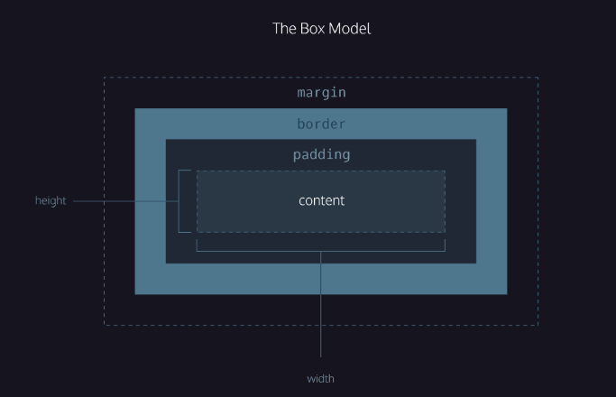

# The Box Model

1. [`width`](https://www.codecademy.com/resources/docs/css/sizing/width) and [`height`](https://www.codecademy.com/resources/docs/css/sizing/height): The width and height of the content area.
2. `padding`: The amount of space between the content area and the border.
3. `border`: The thickness and style of the border surrounding the content area and padding.
4. `margin`: The amount of space between the border and the outside edge of the element.

### Borders

A [_border_](https://www.codecademy.com/resources/docs/css/borders/border) is a line that surrounds an element, like a frame around a painting. [Borders](https://www.codecademy.com/resources/docs/css/borders) can be set with a specific [`width`](https://www.codecademy.com/resources/docs/css/sizing/width), `style`, and [`color`](https://www.codecademy.com/resources/docs/css/colors/color):

- `width`—The thickness of the border. A border’s thickness can be set in pixels or with one of the following keywords: `thin`, `medium`, or `thick`.
- `style`—The design of the border. Web browsers can render any of [10 different styles](https://developer.mozilla.org/en-US/docs/Web/CSS/border-style#Values). Some of these styles include: `none`, `dotted`, and `solid`.
- `color`—The color of the border. Web browsers can render [colors](https://www.codecademy.com/resources/docs/css/colors) using a few different formats, including [140 built-in color keywords](https://developer.mozilla.org/en-US/docs/Web/CSS/color_value).

### Padding and Margin
- Margin collapse
	- The two vertical margins doesnt add, it takes the bigger margin while horizontontal ones adds up.

### Minimum and Maximum Height and Width

Because a web page can be viewed through displays of differing screen size, the content on the web page can suffer from those changes in size. To avoid this problem, CSS offers two properties that can limit how narrow or how wide an element’s box can be sized to:

- [`min-width`](https://www.codecademy.com/resources/docs/css/sizing/min-width)—this property ensures a minimum [width](https://www.codecademy.com/resources/docs/css/sizing/width) of an element’s box.
- [`max-width`](https://www.codecademy.com/resources/docs/css/sizing/max-width)—this property ensures a maximum width of an element’s box.
### Visibility 
**Note:** What’s the difference between `display: none` and `visibility: hidden`? An element with `display: none` will be completely removed from the web page. An element with `visibility: hidden`, however, will not be visible on the web page, but the space reserved for it will.

## Review
In this lesson, we covered the four properties of the box model: height and width, padding, borders, and margins. Understanding the box model is an important step towards learning more advanced HTML and CSS topics. Let’s take a minute to review what you learned:

- The box model comprises a set of properties used to create space around and between HTML elements.
- The height and width of a content area can be set in pixels or percentages.
- Borders surround the content area and padding of an element. The color, style, and thickness of a border
can be set with CSS properties.
- Padding is the space between the content area and the border. It can be set in pixels or percent.
- Margin is the amount of spacing outside of an element’s border.
- Horizontal margins add, so the total space between the borders of adjacent elements is equal to the sum of the right margin of one element and the left margin of the adjacent element.
- Vertical margins collapse, so the space between vertically adjacent elements is equal to the larger margin.
- margin: 0 auto horizontally centers an element inside of its parent content area, if it has a width.
- The overflow property can be set to display, hidden, or scroll, and dictates how HTML will render content that overflows its parent’s content area.
- The visibility property can hide or show elements.