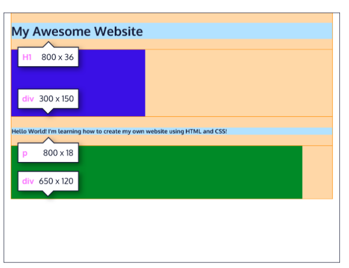

## Position
Take a look at the block-level elements in the image below:

Block-level elements like these boxes create a block the full width of their parent elements, and they prevent other elements from appearing in the same horizontal space.

Notice the block-level elements in the image above take up their own line of space and therefore don’t overlap each other. In the browser to the right, you can see block-level elements also consistently appear on the left side of the browser. This is the default position for block-level elements.

The default position of an element can be changed by setting its position property. The position property can take one of five values:

- static : the default value (it does not need to be specified)

- relative : relative to static fields moves the element with specified offset properties top bottom left  right

- absolute : The element will be positioned relative to its closest positioned parent element, while offset properties can be used to determine the final position from there.

- fixed : fixes an element position so when scrolled down it still stays in this location - This technique is often used for navigation bars on a web page.

- sticky : its fixed with scrolling until the position defined by the offset and then it gets unsticked

- z index: The z-index property controls how far back or how far forward an element should appear on the web page when elements overlap. This can be thought of as the depth of elements, with deeper elements appearing behind shallower elements.

- float:  If you’re simply interested in moving an element as far left or as far right as possible in the container, you can use the float property. Note that moving of elements better with CSS Grid and CSS Flexbox. The float property is often set using one of the values below:
    left - moves, or floats, elements as far left as possible.
    right - moves elements as far right as possible.
Floated elements must have a width specified,Ootherwise, the element will assume the full width of its containing element, and changing the float value will not yield any visible results.

- clear: The clear property specifies how elements should behave when they bump into each other on the page

## Display
Every HTML element has a default display value that dictates if it can share horizontal space with other elements. Some elements fill the entire browser from left to right regardless of the size of their content. Other elements only take up as much horizontal space as their content requires and can be directly next to other elements.

- *inline*: its a default display, dont have a size. it just wraps the elements tightly. Like <em> or <a>. So if you change a <h1> element to inline then it will be rendered with following element in the same horizontal space..

- *block*: Some elements are not displayed in the same line as the content around them. These are called block-level elements. These elements fill the entire width of the page by default, but their width property can also be set. Unless otherwise specified, they are the height necessary to accommodate their content. All levels of headings are block elements. For a complete list of block level elements, visit the MDN documentation https://developer.mozilla.org/en-US/docs/Glossary/Block-level_content.

- *inline-block*: Inline-block elements can appear next to each other and we can specify their dimensions using the width and height properties. Images are the best example of default inline-block elements.
